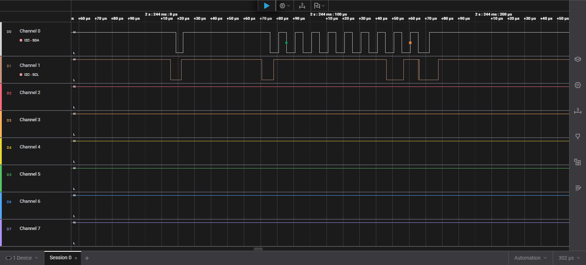
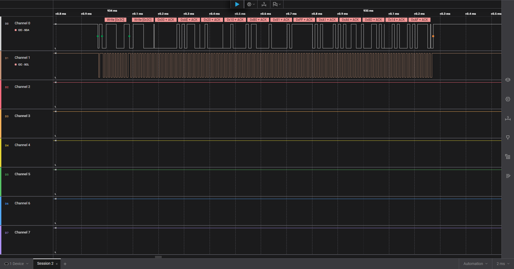
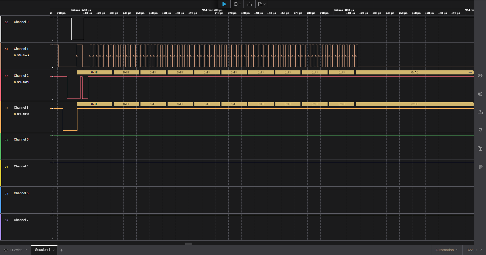

# STM32F446 Bare-Metal Peripheral Library (CMSIS)

A lightweight and easy-to-understand peripheral library written completely in **Bare-Metal C (CMSIS)** for the **STM32F446xx** microcontroller.

### 🎯 What is this repository for?
This project is designed as a **hands-on educational resource** for developers and beginners who want to understand how microcontrollers work under the hood and take a step away from heavy hardware abstraction frameworks like HAL or LL.

Through practical examples, this library demonstrates how to build clean code architecture using handles (`struct`), handle interrupts efficiently (including Finite State Machines), and configure DMA channels for non-blocking data transfers with near-zero CPU overhead.

---

## Key Features & Architectural Highlights

* **Architecture:** Strict object-oriented design patterns using driver context handles (`struct`) allowing easy management of multiple peripheral instances.
* **GPIO & EXTI:** Atomic pin manipulation via `BSRR` register. Supports custom runtime callback assignments globally mapped per physical pin index (0–15).
* **USART / UART:** Interrupt-driven transmission and reception backed by internal static lock-free circular ring buffers. Fully supports asynchronous formatted string streaming via an optimized `usart_printf()` wrapper.
* **USART Advanced DMA:** Advanced `USART2` subsystem incorporating high-efficiency **DMA Receive with IDLE line detection**, enabling rapid variable-length packet parsing completely handled inside the background ISR context.
* **I2C Master FSM:** Fully asynchronous, non-blocking master-mode driver controlled by an internal **Finite State Machine (FSM)** inside Event and Error ISR handlers. Features automatic hardware recovery, NACK tracking, and automated multi-stage retries.
* **SPI Interleaved Mode:** Non-blocking SPI engine operating in either standard IRQ or high-speed DMA modes. Intelligently handles half/full-duplex switching under the hood by automatically mapping missing buffers to internal dummy elements to keep the serial clock scaling.
* **ADC Pipeline:** Multichannel ADC conversion engine utilizing `DMA2` for automated, non-blocking streaming directly into RAM destination buffers with custom end-of-transfer user callbacks.
* **DAC Wave Generator:** Automated digital wave generation via `DAC1 Channel 1` (PA4) synchronized directly to a basic timer update event trigger (`TRGO`) using direct `DMA1` routing.
* **Timers & SysTick:** Modular timing subsystem splitting basic timers (`TIM6`/`TIM7`) for precise millisecond callbacks/delays and general-purpose timers (`TIM2`/`TIM3`) for multichannel PWM output, supplemented by standard ARM Cortex-M `SysTick` timekeeping.

---

## 📁 Driver Layout

```text
Drivers/
├── inc/
│   ├── gpio.h           # Safe atomic GPIO & EXTI mappings
│   ├── usart.h          # Buffered UART, printf & Advanced DMA
│   ├── ring_buffer.h    # Power-of-two index bitwise Ring Buffer
│   ├── i2c.h            # FSM Interrupt-driven I2C Master
│   ├── spi.h            # Polled / DMA synchronous SPI Master
│   ├── adc.h            # Multichannel DMA2 ADC Streamer
│   ├── dac.h            # Timer-triggered DMA1 DAC Wave generator
│   ├── timer.h          # PWM generation & generic basic timers
│   └── systick.h        # System-tick millisecond counter
└── src/
    ├── gpio.c, usart.c, ring_buffer.c, ... (Implementations)

```
---

## API Quick Start & Code Examples

### Init GPIO

Configure an output pin and setup an asynchronous edge trigger with a custom runtime callback.

```C
#include "gpio.h"

void button_press_callback(const gpio_t *gpio) {
    // Handle button event safely inside EXTI ISR context
}

int main(void) {
    gpio_t led = { .port = GPIOA, .pin = 5 };
    gpio_t btn = { .port = GPIOC, .pin = 13 };

    // Initialize LED as Output Push-Pull
    gpio_init(&led, GPIO_MODE_OUTPUT_t, GPIO_PULL_NONE_t, GPIO_SPEED_LOW_t, GPIO_OTYPE_PP_t);
    
    // Setup Button as EXTI Input with Falling Edge trigger
    gpio_init(&btn, GPIO_MODE_INPUT_t, GPIO_PULL_UP_t, GPIO_SPEED_LOW_t, GPIO_OTYPE_PP_t);
    gpio_set_callback(&btn, button_press_callback);
    gpio_enable_irq(&btn, FALLING_EDGE_t);

    while(1) {
        gpio_toggle(&led);
        for(volatile int i=0; i<100000; i++); // Dummy delay
    }
}

```

---

### USART with Circular DMA & IDLE Line Detection

This advanced implementation sets up USART2 to stream incoming bytes directly into memory using a circular DMA pipeline. The CPU remains completely asleep during transfers; it wakes up via the IDLE line interrupt only when a complete packet frame finishes arriving, triggering the asynchronous read_buff user callback.



```C
#include "main.h"
#include "cmsis_gcc.h"
#include "gpio.h"
#include "stm32f446xx.h"
#include "systick.h"
#include "timer.h"
#include <string.h>
#include <usart.h>
#include <stdint.h>


void SystemClock_Config(void);

void read_buff(usart_t *usart, uint16_t size) {
  char ch = 0;
  usart_printf(usart, "Ring buffer: ");
  for(int i = 0; i < size; i++) {
    ring_buffer_pop(usart->rx_buffer, &ch);
    usart_printf(usart, "%c ", ch);
  }
}


int main(void) {
  SystemClock_Config();
  systick_config_ms(100);

  static const gpio_t usart2_pa2 = {GPIOA, 2};
  static const gpio_t usart2_pa3 = {GPIOA, 3};

  gpio_init(&usart2_pa2, GPIO_MODE_AF_t, GPIO_PULL_UP_t, 
    GPIO_OTYPE_PP_t, GPIO_SPEED_HIGH_t);
  gpio_init(&usart2_pa3, GPIO_MODE_AF_t, GPIO_PULL_UP_t, 
    GPIO_OTYPE_PP_t, GPIO_SPEED_HIGH_t);

  gpio_set_alternate_function(&usart2_pa2, 7);
  gpio_set_alternate_function(&usart2_pa3, 7);
  
  usart_t usart_2 = {
    .instance = USART2,
    .bus_freq = 25000000,
    .callback = read_buff
  };

  usart2_rx_init_dma(&usart_2, 115200);

  // send
  uint8_t data = 155;
  usart2_send_dma(&usart_2, &data, sizeof(data));

  
  while(1) {
    __NOP();
  }

}

```
---

### Non-Blocking I2C Master (Finite State Machine)

Instead of blocking execution loops waiting for hardware flags (SB, ADDR, TXE), this I2C driver executes via an interrupt-driven Finite State Machine (FSM). The example below demonstrates launching a complex multi-byte SSD1306 OLED initialization sequence asynchronously.




```C
#include "main.h"
#include "cmsis_gcc.h"
#include "gpio.h"
#include "stm32f446xx.h"
#include "stm32f4xx_hal_gpio.h"
#include "systick.h"
#include "timer.h"
#include <string.h>
#include <usart.h>
#include <stdint.h>
#include <i2c.h>
#include <stdio.h>

void SystemClock_Config(void);

int main(void) {
  SystemClock_Config();
  systick_config_ms(100);

  static const gpio_t usart2_pa2 = {GPIOA, 2};
  static const gpio_t usart2_pa3 = {GPIOA, 3};

  gpio_init(&usart2_pa2, GPIO_MODE_AF_t, GPIO_PULL_UP_t, 
    GPIO_OTYPE_PP_t, GPIO_SPEED_HIGH_t);
  gpio_init(&usart2_pa3, GPIO_MODE_AF_t, GPIO_PULL_UP_t, 
    GPIO_OTYPE_PP_t, GPIO_SPEED_HIGH_t);

  gpio_set_alternate_function(&usart2_pa2, 7);
  gpio_set_alternate_function(&usart2_pa3, 7);
  
  usart_t usart_2 = {
    .instance = USART2,
    .bus_freq = 25000000
  };

  usart_init(&usart_2, 115200);

  // Init I2C
  static const gpio_t i2c1_sda = {GPIOB, 9};
  static const gpio_t i2c1_scl = {GPIOB, 8};

  gpio_init(&i2c1_sda, GPIO_MODE_AF_t, GPIO_PULL_UP_t,
     GPIO_OTYPE_OD_t, GPIO_SPEED_HIGH_t);
  gpio_init(&i2c1_scl, GPIO_MODE_AF_t, GPIO_PULL_UP_t,
     GPIO_OTYPE_OD_t, GPIO_SPEED_HIGH_t);

  gpio_set_alternate_function(&i2c1_sda, 4);
  gpio_set_alternate_function(&i2c1_scl, 4);


  static i2c_t i2c1 = {
    .bus = I2C1
  };

  i2c_init(&i2c1, 25, I2C_MODE_STANDARD_100KHZ);

  uint8_t oled_init_sequence[] = {
    0x00, // Control byte: all next bytes will be comands
    0xAE, // Display OFF
    0x20, // Set Memory Addressing Mode
    0x10, // Page Addressing Mode
    0xB0, // Set Page Start Address
    0x81, // Set Contrast Control
    0xFF, // Maximum brightness
    0xA1, // Set Segment Re-map
    0xA6, // Normal display
    0x8D, // Charge Pump Command
    0x14, // Enable Charge Pump
    0xAF  // Display ON!
  };

  i2c_transaction_t oled_init_tr = {
    .addr = 0x3C,
    .tx_buff = oled_init_sequence,
    .tx_len = sizeof(oled_init_sequence),
    .rx_buff = NULL,
    .rx_len = 0,
    .repeated_start = false,
    .max_retries = 2
  };


  i2c_execute(&i2c1, &oled_init_tr);


  while(1) {
    __NOP();
  }
}

```
---

### High-Performance SPI with Auto-Dummy DMA

Achieve absolute zero-CPU load SPI transactions. When reading or writing selectively, developers often struggle with managing missing transmission parameters. This driver evaluates NULL pointers automatically, shifting memory increment flags (MINC) off and routing missing buffers to standard internal static 0xFF elements to keep bus clock signals scaling dynamically.




``` C
#include "main.h"
#include "cmsis_gcc.h"
#include "gpio.h"
#include "spi.h"
#include "stm32_hal_legacy.h"
#include "stm32f446xx.h"
#include "stm32f4xx_hal_gpio.h"
#include "systick.h"
#include "timer.h"
#include <string.h>
#include <usart.h>
#include <stdint.h>
#include <i2c.h>
#include <spi.h>
#include <stdio.h>

/*
--------SPI PINS--------
VCC     5V
GND
SCK     PA5
MISO    PA6
MOSI    PA7
CS      PB6
------------------------
*/

#define CS_HIGH GPIO_BSRR_BS6   // set
#define CS_LOW GPIO_BSRR_BR6   // reset


void SystemClock_Config(void);

// user callback

void sd_callback(spi_t *spi, volatile spi_transaction_t *tr, spi_status_t status_tr) {
  // CS = 1
  if(status_tr == SPI_OK) {
    // TODO
  }
}

uint8_t tx_cmd0[16] = {
    0x40,                    // CMD0 (0x40 + 0)
    0x00, 0x00, 0x00, 0x00,  // Argument: 0
    0x95,                    // CRC 
    0xFF, 0xFF, 0xFF, 0xFF, 0xFF, 0xFF, 0xFF, 0xFF, 0xFF, 0xFF
};

uint8_t rx_buf[16] = {0}; 

volatile bool tr_ready = false;

void cmd0_callback(spi_t *spi, volatile spi_transaction_t *tr, spi_status_t status_tr) {
    tr_ready = true;
}

// CS global
static const gpio_t cs = {GPIOB, 6};

int main(void) {
  SystemClock_Config();
  systick_config_ms(100);

  // init pins
  static const gpio_t sck = {GPIOA, 5};
  static const gpio_t miso = {GPIOA, 6};
  static const gpio_t mosi = {GPIOA, 7};
  // AF5 , PULL UP, PP, SPEED HIGH
  gpio_init(&sck, GPIO_MODE_AF_t, GPIO_PULL_UP_t, 
    GPIO_OTYPE_PP_t, GPIO_SPEED_VERY_HIGH_t);
  gpio_init(&miso, GPIO_MODE_AF_t, GPIO_PULL_UP_t, 
    GPIO_OTYPE_PP_t, GPIO_SPEED_VERY_HIGH_t);
  gpio_init(&mosi, GPIO_MODE_AF_t, GPIO_PULL_UP_t, 
    GPIO_OTYPE_PP_t, GPIO_SPEED_VERY_HIGH_t);
  gpio_init(&cs, GPIO_MODE_OUTPUT_t, GPIO_PULL_UP_t, 
    GPIO_OTYPE_PP_t, GPIO_SPEED_VERY_HIGH_t);

  gpio_set_alternate_function(&sck, 5);
  gpio_set_alternate_function(&miso, 5);
  gpio_set_alternate_function(&mosi, 5);
  
  // UART
  static const gpio_t usart2_pa2 = {GPIOA, 2};
  static const gpio_t usart2_pa3 = {GPIOA, 3};
  gpio_init(&usart2_pa2, GPIO_MODE_AF_t, GPIO_PULL_UP_t, 
    GPIO_OTYPE_PP_t, GPIO_SPEED_HIGH_t);
  gpio_init(&usart2_pa3, GPIO_MODE_AF_t, GPIO_PULL_UP_t, 
    GPIO_OTYPE_PP_t, GPIO_SPEED_HIGH_t);
  gpio_set_alternate_function(&usart2_pa2, 7);
  gpio_set_alternate_function(&usart2_pa3, 7);

  usart_t usart_2 = {
    .instance = USART2,
    .bus_freq = 25000000
  };
  usart_init(&usart_2, 115200);

  // INIT SPI
  static spi_t spi1 = {
    .instance = SPI1, 
    .dma_instance = DMA2,
    .dma_stream_tx = DMA2_Stream3, 
    .dma_tx_channel = 3,
    .dma_stream_rx = DMA2_Stream0,
    .dma_rx_channel = 3
  };
  // For init SD need 100–400kgz
  spi_init(&spi1, SPI_BAUDRATE_DIV128);
  spi_config_dma(&spi1);

  // for test use SD card
  // Power On Sequence: CS = 1, send 10 times 0xFF. Expected response: R1_IDLE_STATE (0x01)
  
  uint8_t sd_seq[10] = {0xFF, 0xFF, 0xFF, 0xFF, 0xFF, 0xFF, 0xFF, 0xFF, 0xFF, 0xFF};
  spi_transaction_t power_on = {
    .tx_buff = sd_seq,
    .tx_len = sizeof(sd_seq),
    .rx_buff = NULL,
    .rx_len = 0,
    .callback = sd_callback
  };

  spi_transaction_t cmd0_trans = {
          .tx_buff = tx_cmd0,
          .rx_buff = rx_buf,
          .tx_len = 16,
          .rx_len = 16,
          .callback = cmd0_callback
  };
  cs.port->BSRR = CS_HIGH;
  spi_execute_transaction_dma(&spi1, &power_on);
  while(spi1.state != SPI_READY);
  delay_ms(1);

  cs.port->BSRR = CS_LOW;
  delay_ms(1); 
  tr_ready = false;
  spi_execute_transaction_dma(&spi1, &cmd0_trans);
  while(!tr_ready) {
      __WFI();
  }
  cs.port->BSRR = CS_HIGH;
  
  uint8_t response = 0xFF;
  for(int i = 6; i < 16; i++) {
      if(rx_buf[i] != 0xFF) { 
          response = rx_buf[i];
          break;
      }
  }
  if(response == 0x01) {
    usart_printf(&usart_2, "Response OK: 0x01\n");
  } else {
    usart_printf(&usart_2, "Response Error\n");
  }

  while(1) {
    __NOP();
  }
}

```
---

### Advanced Timer -> DAC -> DMA -> ADC Loopback Pipeline

A massive, high-throughput loopback demonstration configuration showcasing bare-metal performance:

1. Basic Timer (TIM6) fires periodic update trigger outputs (TRGO) at precise millisecond bounds.

2. DAC1 Peripheral traps the hardware TRGO event natively, automatically offloading data frames from RAM out through DMA1 to produce precise analogue signal variants on pin PA4.

3. ADC1 Peripheral monitors the target analogue output on pin PA0, updating memory buffers inside an automated continuous streaming loop directly handled by DMA2 interrupts.

```C
#include "main.h"
#include "ADC.h"
#include "cmsis_gcc.h"
#include "gpio.h"
#include "stm32f446xx.h"
#include "stm32f4xx_hal_gpio.h"
#include "systick.h"
#include "timer.h"
#include <string.h>
#include <usart.h>
#include <stdint.h>
#include "DAC.h"


void SystemClock_Config(void);


// buffer for ADC 1 channel
uint16_t adc_res_buffer[1] = {0};
uint16_t dac_wave[4] = {0, 1000, 2048, 4095}; // Signal for DAC

// for live watch
volatile uint16_t current_adc_value = 0;

// channel for ADC (PA0 (channel 0))
adc_channel_config_t adc_ch[] = {
    { .channel_number = 0, .sampling_time = 3 }
};

// ADC test callback
void my_adc_callback(adc_t *adc) {
    current_adc_value = adc_res_buffer[0]; // Забираем то, что прочитал АЦП
}

int main(void) {
  SystemClock_Config();
  systick_config_ms(100);

  static const gpio_t usart2_pa2 = {GPIOA, 2};
  static const gpio_t usart2_pa3 = {GPIOA, 3};

  gpio_init(&usart2_pa2, GPIO_MODE_AF_t, GPIO_PULL_UP_t, 
    GPIO_OTYPE_PP_t, GPIO_SPEED_HIGH_t);
  gpio_init(&usart2_pa3, GPIO_MODE_AF_t, GPIO_PULL_UP_t, 
    GPIO_OTYPE_PP_t, GPIO_SPEED_HIGH_t);

  gpio_set_alternate_function(&usart2_pa2, 7);
  gpio_set_alternate_function(&usart2_pa3, 7);
  
  usart_t usart_2 = {
    .instance = USART2,
    .bus_freq = 25000000
  };
  //usart_init(&usart_2, 115200);
  usart_init(&usart_2, 115200);

  static const gpio_t adc_pa0 = {GPIOA, 0}; 
  gpio_init(&adc_pa0, GPIO_MODE_ANALOG_t, GPIO_PULL_UP_t, 
    GPIO_OTYPE_PP_t, GPIO_SPEED_HIGH_t);
  

  static const gpio_t dac_pa4 = {GPIOA, 4};
  gpio_init(&dac_pa4, GPIO_MODE_ANALOG_t, GPIO_PULL_UP_t, 
    GPIO_OTYPE_PP_t, GPIO_SPEED_HIGH_t);

  timer_basic_t tim6 = {TIM6, 50};
  timer_basic_init_ms(&tim6, 100);

  // DAC
  dac_t my_dac = {
    .instance = DAC1,
    .wave_buffer = dac_wave,
    .num_points = 4
  };
  dac_init(&my_dac, &tim6);
  dac_start(&my_dac);

  // ADC
  adc_t my_adc = {
    .instance = ADC1,
    .adc_channels = adc_ch,
    .num_channels = 1,
    .data_buffer = adc_res_buffer,
    .callback = my_adc_callback
  };
  adc_init(&my_adc, CONTINUOUS);


  while(1) {
    __NOP();
    usart_printf(&usart_2, "Raw number: %d\n", current_adc_value);
    delay_ms(500);
  }
}


```
---

## Requirements & Toolchain
* Target Device: STM32F446xx (Nucleo-F446RE, etc.)
* Toolchain: arm-none-eabi-gcc v10.x or newer
* Required System Files: CMSIS Core device library register definition files (stm32f446xx.h, system_stm32f4xx.h) included in compiler include paths.


## License

This project is licensed under the MIT License - see the LICENSE file for details.